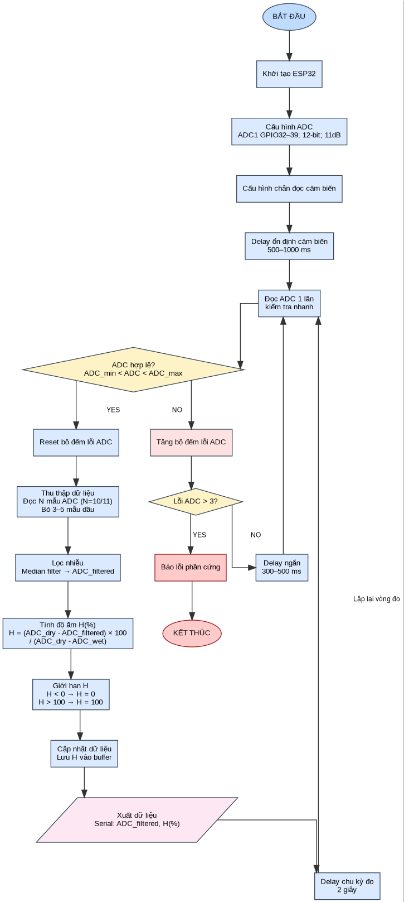

# Giải thích flowchart soil_moisture

## Wiring

VCC  -> 3.3V ESP32
GND  -> GND ESP32
AOUT -> GPIO34



## 1. BẮT ĐẦU

Đây là điểm khởi động của toàn bộ quy trình. Khi ESP32 được cấp nguồn hoặc nhấn reset, hệ thống bắt đầu chạy từ đây. Block này không xử lý dữ liệu, chỉ thể hiện rằng chương trình bắt đầu bước vào quy trình đo độ ẩm đất.

---

## 2. Khởi tạo ESP32

Block này nghĩa là ESP32 chuẩn bị trạng thái ban đầu để làm việc.

Nó cần chuẩn bị các phần như: bật giao tiếp Serial để xem kết quả trên máy tính, chuẩn bị biến lưu dữ liệu, chuẩn bị biến đếm lỗi, và đưa hệ thống về trạng thái ban đầu. Hiểu đơn giản là trước khi đo, ESP32 phải “dọn bàn làm việc” trước.

---

## 3. Cấu hình ADC

```text
ADC1 GPIO32–39; 12-bit; 11dB
```

Đây là block rất quan trọng.

Cảm biến độ ẩm đất điện dung xuất ra **điện áp analog**. ESP32 không xử lý trực tiếp điện áp analog theo kiểu “1.5V, 2.3V”, mà phải chuyển nó thành số. Bộ làm việc này gọi là **ADC**.

`ADC1 GPIO32–39` nghĩa là dùng nhóm chân ADC1 của ESP32, ví dụ GPIO32, 33, 34, 35, 36, 39. Dùng ADC1 là hợp lý vì sau này nếu dùng WiFi/Blynk thì ADC1 ít bị xung đột hơn ADC2.

`12-bit` nghĩa là kết quả đọc ADC nằm trong khoảng:

```text
0 → 4095
```

Tức là điện áp càng thấp thì ADC càng gần 0; điện áp càng cao thì ADC càng gần 4095.

`11dB` là mức suy hao ADC để ESP32 đọc được dải điện áp rộng hơn. Vì cảm biến soil moisture thường xuất tín hiệu analog khoảng 0–3V, nên dùng 11dB là hợp lý.

---

## 4. Cấu hình chân đọc cảm biến

Block này nghĩa là chọn chân ESP32 nào nối với chân tín hiệu analog của cảm biến.

Ví dụ cảm biến có 3 chân:

```text
VCC
GND
AOUT
```

Thì `AOUT` sẽ nối vào một chân ADC của ESP32, chẳng hạn GPIO34.

Block này đảm bảo ESP32 biết rằng chân đó dùng để **đọc tín hiệu vào**, không phải xuất tín hiệu ra.

---

## 5. Delay ổn định cảm biến

```text
500–1000 ms
```

Sau khi cấp nguồn, cảm biến và mạch ADC chưa chắc ổn định ngay. Trong vài trăm mili giây đầu, điện áp có thể dao động.

Nếu đo ngay lập tức, giá trị có thể sai. Vì vậy hệ thống chờ khoảng 0.5–1 giây rồi mới bắt đầu đọc.

Hiểu đơn giản: bật cảm biến lên, đợi nó “vào trạng thái ổn định”, rồi mới tin kết quả đo.

---

## 6. Đọc ADC 1 lần kiểm tra nhanh

Block này không phải là đo chính thức. Nó chỉ đọc một lần để kiểm tra xem cảm biến có đang hoạt động bình thường không.

Ví dụ đọc ra:

```text
ADC = 2500
```

thì có vẻ bình thường.

Nếu đọc ra:

```text
ADC = 0
```

hoặc:

```text
ADC = 4095
```

thì có khả năng dây tín hiệu bị đứt, cắm sai, cảm biến chưa cấp nguồn, hoặc tín hiệu bị chập.

---

## 7. ADC hợp lệ?

```text
ADC_min < ADC < ADC_max
```

Đây là block quyết định.

Nó kiểm tra giá trị ADC vừa đọc có nằm trong khoảng hợp lý không.

Ví dụ đặt:

```text
ADC_min = 100
ADC_max = 4000
```

Thì:

```text
ADC = 2500 → hợp lệ
ADC = 0 → không hợp lệ
ADC = 4095 → không hợp lệ
```

Block này giúp hệ thống không xử lý dữ liệu rác. Nếu cảm biến lỗi mà vẫn đem đi tính độ ẩm thì kết quả sẽ sai hoàn toàn.

---

## 8. Reset bộ đếm lỗi ADC

Block này xảy ra khi ADC hợp lệ.

Nghĩa là cảm biến vừa đọc được giá trị bình thường, nên số lần lỗi trước đó được xóa về 0.

Tại sao cần reset? Vì hệ thống chỉ muốn phát hiện **lỗi liên tục**, không muốn kết luận hỏng chỉ vì một lần nhiễu ngẫu nhiên.

Ví dụ:

```text
Lần 1 lỗi
Lần 2 đọc OK → reset lỗi về 0
```

Như vậy hệ thống ổn định hơn.

---

## 9. Thu thập dữ liệu

```text
Đọc N mẫu ADC (N=10/11)
Bỏ 3–5 mẫu đầu
```

Đây là bước đo chính thức.

Thay vì đọc một giá trị duy nhất, hệ thống đọc nhiều mẫu ADC. Ví dụ đọc 11 lần.

Lý do là tín hiệu analog dễ bị nhiễu. Nếu chỉ đọc một lần, kết quả có thể bị lệch. Đọc nhiều lần giúp có dữ liệu đủ để lọc.

`Bỏ 3–5 mẫu đầu` nghĩa là vài giá trị đầu tiên không dùng để tính. Chúng có thể chưa ổn định do ADC vừa bắt đầu đọc hoặc tín hiệu còn dao động.

Hiểu đơn giản:

```text
Đọc thử vài mẫu đầu cho ổn định
Sau đó mới lấy các mẫu chính thức
```

---

## 10. Lọc nhiễu

```text
Median filter → ADC_filtered
```

Block này xử lý các mẫu ADC đã thu thập.

Median filter nghĩa là **lọc trung vị**. Nó sắp xếp các giá trị ADC rồi lấy giá trị nằm giữa.

Ví dụ có các mẫu:

```text
2498, 2501, 2500, 4000, 2499
```

Sắp xếp lại:

```text
2498, 2499, 2500, 2501, 4000
```

Giá trị ở giữa là:

```text
2500
```

Vậy:

```text
ADC_filtered = 2500
```

Giá trị `4000` là nhiễu đột biến, nhưng không làm ảnh hưởng nhiều đến kết quả. Đây là lý do median filter rất hợp với cảm biến analog.

---

## 11. Tính độ ẩm H(%)

```text
H = (ADC_dry - ADC_filtered) × 100 / (ADC_dry - ADC_wet)
```

Block này đổi giá trị ADC thành phần trăm độ ẩm.

Với cảm biến soil moisture điện dung thường gặp:

```text
Đất khô → ADC cao
Đất ướt → ADC thấp
```

Cần có 2 giá trị hiệu chuẩn:

```text
ADC_dry: giá trị ADC khi đất khô / ngoài không khí
ADC_wet: giá trị ADC khi đất ướt / trong nước
```

Ví dụ:

```text
ADC_dry = 3200
ADC_wet = 1400
ADC_filtered = 2300
```

Thì:

```text
H = (3200 - 2300) × 100 / (3200 - 1400)
H = 50%
```

Nghĩa là cảm biến đang đo được trạng thái nằm giữa khô và ướt.

---

## 12. Giới hạn H

```text
H < 0 → H = 0
H > 100 → H = 100
```

Do nhiễu, sai số hoặc môi trường thực tế khác lúc hiệu chuẩn, kết quả tính ra có thể nhỏ hơn 0 hoặc lớn hơn 100.

Ví dụ:

```text
H = -5%
```

thì ép về:

```text
H = 0%
```

Nếu:

```text
H = 108%
```

thì ép về:

```text
H = 100%
```

Block này đảm bảo kết quả cuối cùng luôn nằm trong khoảng hợp lý:

```text
0% → 100%
```

---

## 13. Cập nhật dữ liệu

```text
Lưu H vào buffer
```

Sau khi tính được độ ẩm, hệ thống lưu giá trị này vào bộ nhớ tạm gọi là buffer.

Buffer ở đây hiểu đơn giản là nơi giữ dữ liệu mới nhất để các phần khác dùng tiếp.

Ví dụ:

```text
H = 42.5%
```

thì lưu vào buffer.

Sau này buffer có thể dùng cho:

```text
hiển thị Serial
gửi Blynk
lưu lịch sử
tính trung bình
đưa vào thuật toán cảnh báo
```

---

## 14. Xuất dữ liệu

```text
Serial: ADC_filtered, H(%)
```

Block này đưa kết quả ra ngoài để người dùng xem.

Ở giai đoạn test cảm biến, thường xuất ra Serial Monitor trên máy tính.

Nó sẽ hiển thị hai thông tin chính:

```text
ADC_filtered: giá trị ADC sau lọc
H(%): độ ẩm đất sau quy đổi
```

Ví dụ:

```text
ADC_filtered = 2300
H = 50.0%
```

---

## 15. Delay chu kỳ đo 2 giây

Sau khi xuất dữ liệu, hệ thống không đo ngay lập tức mà chờ 2 giây.

Vì độ ẩm đất thay đổi chậm, không cần đo liên tục từng mili giây. Đo mỗi 2 giây là đủ cho giai đoạn test.

Block này giúp:

```text
dữ liệu dễ đọc hơn
giảm nhiễu do đọc quá dày
giảm tải cho hệ thống
```

---

## 16. Lặp lại vòng đo

Sau delay 2 giây, hệ thống quay lại bước đọc ADC kiểm tra nhanh.

Tức là quy trình chạy liên tục:

```text
Đọc → kiểm tra → lọc → tính → xuất → chờ → đọc lại
```

---

## 17. Tăng bộ đếm lỗi ADC

Block này nằm ở nhánh ADC không hợp lệ.

Nếu giá trị ADC bất thường, hệ thống không báo hỏng ngay mà tăng bộ đếm lỗi lên 1.

Ví dụ:

```text
Lần lỗi 1 → error = 1
Lần lỗi 2 → error = 2
Lần lỗi 3 → error = 3
```

Mục đích là phân biệt giữa:

```text
nhiễu tạm thời
```

và:

```text
lỗi phần cứng thật sự
```

---

## 18. Lỗi ADC > 3?

Block này kiểm tra số lần lỗi liên tiếp.

Nếu lỗi chưa quá 3 lần, hệ thống chưa kết luận hỏng. Nó chỉ delay ngắn rồi thử đọc lại.

Nếu lỗi quá 3 lần, nghĩa là cảm biến liên tục trả giá trị bất thường. Khi đó có khả năng cao là lỗi phần cứng.

---

## 19. Delay ngắn 300–500 ms

Block này xảy ra khi ADC lỗi nhưng chưa quá số lần cho phép.

Hệ thống chờ một chút rồi đọc lại.

Lý do: nếu lỗi do nhiễu tạm thời, sau 300–500 ms có thể tín hiệu sẽ bình thường lại.

---

## 20. Báo lỗi phần cứng

Block này xảy ra khi lỗi ADC liên tiếp quá 3 lần.

Có thể do:

```text
cảm biến chưa cắm
đứt dây tín hiệu
cắm sai chân
mất nguồn cảm biến
cảm biến hỏng
```

Khi đến block này, hệ thống không nên tiếp tục tính độ ẩm nữa, vì dữ liệu đầu vào đã không đáng tin.

---

## 21. KẾT THÚC

Đây là trạng thái dừng khi có lỗi nghiêm trọng.

Nó khác với delay 2 giây ở vòng đo bình thường. Delay 2 giây là nghỉ rồi đo tiếp. Còn kết thúc là hệ thống dừng vì phát hiện lỗi phần cứng.
