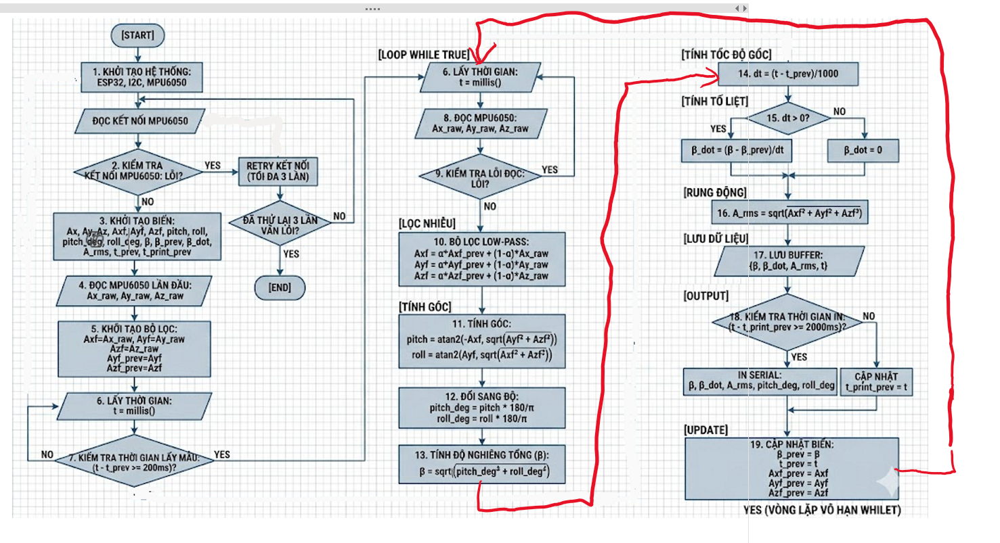

# Giải thích flowchart MPU6050

## Wiring

MPU6050 VCC  -> ESP32 3V3
MPU6050 GND  -> ESP32 GND
MPU6050 SCL  -> ESP32 GPIO22
MPU6050 SDA  -> ESP32 GPIO21


// Ctrl + Shift + V để hiển thị Preview ảnh

## Giải thích Flowchart

## 1. START

Đây là điểm bắt đầu chương trình. Khi ESP32 được cấp nguồn hoặc reset, chương trình bắt đầu chạy từ đây.

---

## 1. Khởi tạo hệ thống: ESP32, I2C, MPU6050

Block này chuẩn bị phần cứng.

ESP32 là vi điều khiển trung tâm. I2C là giao tiếp dùng để ESP32 nói chuyện với MPU6050 qua 2 dây chính: SDA và SCL. MPU6050 là cảm biến IMU có gia tốc kế và con quay hồi chuyển, nhưng trong flowchart này m chỉ dùng **accelerometer**, tức là chỉ dùng gia tốc kế.

Ý nghĩa của block này là: mở Serial nếu cần debug, khởi động I2C, cấu hình địa chỉ MPU6050, đánh thức MPU6050 khỏi chế độ sleep và cấu hình thang đo gia tốc.

Ở giai đoạn test cảm biến, việc này giúp đảm bảo ESP32 đã sẵn sàng đọc dữ liệu từ MPU6050.

---

## Đọc kết nối MPU6050

Block này là bước kiểm tra ban đầu xem ESP32 có giao tiếp được với MPU6050 hay không.

Nó thường làm bằng cách đọc thử cảm biến hoặc đọc thanh ghi nhận dạng của MPU6050. Nếu cảm biến phản hồi đúng, nghĩa là dây nguồn, GND, SDA, SCL và địa chỉ I2C đang ổn.

---

## 2. Kiểm tra kết nối MPU6050: Lỗi?

Đây là block điều kiện.

Nếu **không lỗi**, chương trình đi tiếp sang khởi tạo biến. Nếu **lỗi**, chương trình không được chạy tiếp ngay, vì nếu không đọc được cảm biến thì các giá trị `Ax`, `Ay`, `Az`, `pitch`, `roll`, `β` phía sau đều không có ý nghĩa.

Vì vậy nhánh lỗi sẽ đi sang block retry kết nối.

---

## Retry kết nối tối đa 3 lần

Block này cho hệ thống thử lại kết nối MPU6050 một vài lần trước khi kết luận cảm biến lỗi.

Lý do không dừng ngay từ lần lỗi đầu tiên là vì khi mới cấp nguồn, I2C hoặc cảm biến có thể chưa ổn định ngay. Retry 3 lần giúp hệ thống có cơ hội tự phục hồi.

Nếu sau 3 lần vẫn lỗi, chương trình đi đến END. Nếu trong quá trình retry cảm biến phản hồi lại, chương trình quay lại luồng khởi tạo.

---

## Đã thử lại 3 lần vẫn lỗi?

Đây là block quyết định sau retry.

Nếu **YES**, tức là đã thử lại đủ 3 lần mà vẫn không kết nối được, hệ thống dừng. Nếu **NO**, tức là chưa đủ 3 lần hoặc có thể thử tiếp, chương trình quay lại bước đọc kết nối MPU6050.

Ý nghĩa của cụm block này là tạo cơ chế bảo vệ: không cho chương trình chạy khi phần cứng chưa sẵn sàng.

---

## END

END chỉ xảy ra khi cảm biến không kết nối được sau nhiều lần thử.

Trong code thật, END thường không phải là kết thúc chương trình theo kiểu máy tính, mà có thể là:

```cpp
while (true) {
  delay(1000);
}
```

Tức là ESP32 đứng yên tại đó và không xử lý tiếp.

---

## 3. Khởi tạo biến

Block này tạo và đặt giá trị ban đầu cho các biến dùng trong thuật toán.

Các nhóm biến chính gồm:

`Ax, Ay, Az` là gia tốc thô hoặc gia tốc đọc được từ MPU6050 theo 3 trục X, Y, Z.

`Axf, Ayf, Azf` là gia tốc sau lọc. Chữ `f` có thể hiểu là filtered.

`pitch, roll` là góc nghiêng tính được từ gia tốc. Pitch thường hiểu là nghiêng trước/sau, roll là nghiêng trái/phải.

`pitch_deg, roll_deg` là pitch và roll sau khi đổi từ radian sang độ.

`β` là góc nghiêng tổng hợp. Nó gom pitch và roll thành một giá trị duy nhất để dễ theo dõi.

`β_prev` là giá trị β của lần đo trước. Biến này cần để tính tốc độ thay đổi góc.

`β_dot` là tốc độ thay đổi của β, tức là β thay đổi bao nhiêu độ trong 1 giây.

`A_rms` là chỉ số gia tốc tổng hợp, dùng như một đại lượng quan sát rung động.

`t_prev` là thời điểm lấy mẫu trước.

`t_print_prev` là thời điểm in dữ liệu Serial lần trước.

Block này quan trọng vì nếu biến không được khởi tạo, chương trình có thể dùng giá trị rác, làm kết quả tính toán sai ngay từ đầu.

---

## 4. Đọc MPU6050 lần đầu

Sau khi khai báo biến, hệ thống đọc MPU6050 một lần đầu tiên để lấy:

```text
Ax_raw, Ay_raw, Az_raw
```

Đây là dữ liệu ban đầu của gia tốc kế.

Mục đích của bước này không phải để phân tích ngay, mà chủ yếu để có giá trị ban đầu cho bộ lọc. Nếu không đọc lần đầu, các biến lọc như `Axf_prev`, `Ayf_prev`, `Azf_prev` có thể đang bằng 0, làm tín hiệu lọc ở vài vòng đầu bị lệch.

---

## 5. Khởi tạo bộ lọc

Block này gán:

```text
Axf = Ax_raw
Ayf = Ay_raw
Azf = Az_raw
Axf_prev = Axf
Ayf_prev = Ayf
Azf_prev = Azf
```

Ý nghĩa là lấy giá trị đo đầu tiên làm trạng thái ban đầu của bộ lọc.

Ví dụ nếu cảm biến đang đứng yên, giá trị thực có thể gần:

```text
Ax_raw ≈ 0g
Ay_raw ≈ 0g
Az_raw ≈ 1g
```

Nếu không khởi tạo filter bằng giá trị thật mà để mặc định bằng 0, bộ lọc sẽ mất vài chu kỳ để kéo giá trị từ 0 về gần 1g, làm dữ liệu đầu ra ban đầu bị sai.

Nói đơn giản: block này giúp filter bắt đầu từ trạng thái hợp lý.

---

## 6. Lấy thời gian: t = millis()

Đây là block bắt đầu vòng lặp đo.

`millis()` là hàm trả về thời gian đã trôi qua kể từ khi ESP32 bắt đầu chạy, đơn vị là mili giây.

Ví dụ:

```text
t = 1000 nghĩa là hệ thống đã chạy 1 giây
t = 5200 nghĩa là hệ thống đã chạy 5.2 giây
```

Flowchart dùng `millis()` thay vì `delay()` vì `millis()` cho phép kiểm soát thời gian theo kiểu không chặn. Sau này khi gộp thêm soil moisture, PT100, IoT, hệ thống vẫn có thể chạy nhiều việc theo chu kỳ khác nhau.

---

## 7. Kiểm tra thời gian lấy mẫu: t - t_prev >= 200ms?

Block này quyết định đã đến lúc đọc cảm biến chưa.

Nếu:

```text
t - t_prev < 200ms
```

nghĩa là chưa đủ chu kỳ, hệ thống quay lại block 6 để lấy thời gian mới.

Nếu:

```text
t - t_prev >= 200ms
```

nghĩa là đã đủ 200 ms, hệ thống đi tiếp sang đọc MPU6050.

200 ms tương đương 5 lần mỗi giây, tức tần số lấy mẫu khoảng 5 Hz. Với test độ nghiêng đất, 5 Hz là đủ để nhìn thay đổi tương đối mượt mà mà không làm Serial quá rối.

Điểm quan trọng: block này không làm ESP32 “ngủ” 200 ms, mà chỉ kiểm tra thời gian. Đây là cách làm tốt hơn `delay(200)` khi sau này gộp hệ.

---

## 8. Đọc MPU6050: Ax_raw, Ay_raw, Az_raw

Block này đọc gia tốc thô từ MPU6050 theo 3 trục.

`Ax_raw` là gia tốc trục X.
`Ay_raw` là gia tốc trục Y.
`Az_raw` là gia tốc trục Z.

Trong code, giá trị đọc từ thanh ghi MPU6050 thường là số nguyên 16-bit, sau đó được đổi sang đơn vị `g`.

Ví dụ với thang đo ±2g, thường dùng hệ số:

```text
Ax = rawAx / 16384.0
```

Sau khi đổi, nếu cảm biến đứng yên trên mặt phẳng, tổng gia tốc thường gần 1g do trọng lực.

---

## 9. Kiểm tra lỗi đọc?

Block này kiểm tra xem lần đọc MPU6050 có hợp lệ không.

Lỗi có thể xảy ra do:

I2C không phản hồi, dây SDA/SCL lỏng, cảm biến mất nguồn, địa chỉ I2C sai, hoặc dữ liệu đọc không đủ byte.

Nếu **YES**, tức là đọc lỗi, hệ thống quay lại block 6 để chờ vòng đọc tiếp theo. Không nên dùng dữ liệu lỗi để tính góc vì sẽ làm kết quả nhảy lung tung.

Nếu **NO**, tức là đọc được dữ liệu hợp lệ, chương trình đi tiếp sang lọc nhiễu.

---

## 10. Bộ lọc Low-pass

Block này lọc nhiễu gia tốc.

Công thức:

```text
Axf = α·Axf_prev + (1-α)·Ax_raw
Ayf = α·Ayf_prev + (1-α)·Ay_raw
Azf = α·Azf_prev + (1-α)·Az_raw
```

Trong đó:

`α` là hệ số lọc, thường chọn khoảng 0.85.

Nếu `α = 0.85`, nghĩa là giá trị sau lọc lấy 85% từ giá trị cũ và 15% từ giá trị mới.

Nói dễ hiểu: bộ lọc này không tin hoàn toàn vào mẫu mới, vì mẫu mới có thể bị nhiễu. Nó chỉ cập nhật từ từ, nhờ vậy tín hiệu mượt hơn.

Ví dụ:

```text
Axf_prev = 0.00
Ax_raw = 0.20
α = 0.85

Axf = 0.85×0.00 + 0.15×0.20 = 0.03
```

Giá trị không nhảy thẳng từ 0 lên 0.2, mà chỉ nhích lên 0.03. Vì vậy giảm rung số liệu.

---

## 11. Tính góc pitch, roll

Block này dùng gia tốc đã lọc để tính góc nghiêng.

Công thức:

```text
pitch = atan2(-Axf, sqrt(Ayf² + Azf²))
roll  = atan2(Ayf, sqrt(Axf² + Azf²))
```

Ý nghĩa vật lý: khi MPU6050 đứng yên, cảm biến đo thành phần trọng lực trên 3 trục X, Y, Z. Khi cảm biến nghiêng, trọng lực sẽ “chia” sang các trục khác nhau. Dựa vào tỷ lệ giữa các trục, ta tính được góc nghiêng.

Tại sao dùng `Axf`, `Ayf`, `Azf` thay vì `Ax_raw`, `Ay_raw`, `Az_raw`?

Vì dữ liệu đã lọc ổn định hơn. Nếu dùng raw trực tiếp, pitch và roll sẽ nhảy nhiều.

Dấu `-Axf` phụ thuộc cách đặt trục MPU6050. Nếu gắn cảm biến ngược chiều, dấu có thể đổi. Vì vậy trong flowchart có ghi chú “dấu phụ thuộc quy ước hệ trục MPU6050”.

---

## 12. Đổi sang độ

Hàm `atan2()` trả về đơn vị radian. Nhưng người dùng và báo cáo thường đọc góc theo độ.

Công thức đổi:

```text
pitch_deg = pitch × 180 / π
roll_deg  = roll × 180 / π
```

Ví dụ:

```text
π rad = 180°
π/2 rad = 90°
```

Sau block này, pitch và roll đã ở đơn vị độ, dễ quan sát trên Serial.

---

## 13. Tính độ nghiêng tổng β

Block này tính:

```text
β = sqrt(pitch_deg² + roll_deg²)
```

Ý nghĩa: pitch cho biết nghiêng theo một hướng, roll cho biết nghiêng theo hướng còn lại. Nhưng khi test hệ thống, m thường cần một con số tổng để biết cảm biến đang nghiêng nhiều hay ít. Vì vậy dùng β.

Ví dụ:

```text
pitch_deg = 3°
roll_deg = 4°

β = sqrt(3² + 4²) = 5°
```

β càng lớn thì cảm biến càng nghiêng mạnh.

Trong đồ án, β có thể dùng như đại lượng đại diện cho độ nghiêng của khối đất hoặc mô hình đất.

---

## 14. Tính dt

Block này tính khoảng thời gian giữa lần đo hiện tại và lần đo trước:

```text
dt = (t - t_prev) / 1000
```

Vì `millis()` cho thời gian theo mili giây, nên chia 1000 để đổi sang giây.

Ví dụ:

```text
t = 1400 ms
t_prev = 1200 ms

dt = (1400 - 1200) / 1000 = 0.2 s
```

`dt` rất quan trọng vì muốn tính tốc độ thay đổi góc thì phải biết thay đổi trong bao lâu.

---

## 15. dt > 0?

Đây là block bảo vệ.

Nếu `dt > 0`, hệ thống tính tốc độ góc bình thường.

Nếu `dt = 0`, không được chia cho 0, vì sẽ gây lỗi toán học. Khi đó gán:

```text
β_dot = 0
```

Trong thực tế, nếu block kiểm tra chu kỳ lấy mẫu hoạt động đúng thì `dt` thường lớn hơn 0. Tuy vậy, giữ block này giúp thuật toán an toàn hơn.

---

## β_dot = (β - β_prev) / dt

Đây là tốc độ thay đổi của góc nghiêng.

Công thức:

```text
β_dot = (β - β_prev) / dt
```

Ý nghĩa:

`β` là góc hiện tại.
`β_prev` là góc trước đó.
`dt` là thời gian giữa hai lần đo.

Nếu β tăng nhanh trong thời gian ngắn thì β_dot lớn. Nếu β gần như không đổi thì β_dot gần 0.

Ví dụ:

```text
β_prev = 5°
β = 7°
dt = 0.2s

β_dot = (7 - 5) / 0.2 = 10 °/s
```

Trong bài toán đất hoặc sạt lở, không chỉ góc nghiêng quan trọng, mà tốc độ thay đổi góc cũng quan trọng. Một góc nghiêng nhỏ nhưng tăng nhanh vẫn có thể là dấu hiệu bất thường.

---

## β_dot = 0

Nhánh này xảy ra khi `dt <= 0`.

Mục đích là tránh chia cho 0. Đây là giá trị an toàn tạm thời, không đại diện cho chuyển động thật, nhưng giúp chương trình không lỗi.

---

## 16. Tính A_rms

Block này tính:

```text
A_rms = sqrt(Axf² + Ayf² + Azf²)
```

Ở flowchart của m, `A_rms` đang dùng như độ lớn tổng của vector gia tốc, đơn vị là `g`.

Nếu cảm biến đứng yên, tổng gia tốc thường gần:

```text
1g
```

do cảm biến đang đo trọng lực.

Nếu có rung động hoặc va chạm, giá trị này có thể dao động hoặc tăng lên.

Lưu ý: đây là chỉ số quan sát rung động đơn giản. Nếu muốn đo rung động động học “sạch” hơn sau này, có thể dùng:

```text
A_dynamic = |A_rms - 1g|
```

để loại thành phần trọng lực. Nhưng trong giai đoạn test cảm biến, công thức hiện tại là đủ và dễ hiểu.

---

## 17. Lưu buffer

Block này lưu các giá trị quan trọng:

```text
{β, β_dot, A_rms, t}
```

Buffer có thể hiểu là nơi lưu dữ liệu tạm thời.

Trong giai đoạn test, buffer giúp m gom dữ liệu đã xử lý để in Serial. Sau này khi gộp hệ, buffer có thể dùng để gửi lên Blynk, lưu lịch sử, vẽ graph hoặc đưa vào thuật toán cảnh báo.

Ở mức đơn giản, buffer có thể chỉ là các biến lưu giá trị mới nhất:

```text
betaBuffer = β
betaDotBuffer = β_dot
armsBuffer = A_rms
```

Ở mức nâng cao, buffer có thể là mảng hoặc queue lưu nhiều mẫu theo thời gian.

---

## 18. Kiểm tra thời gian in: t - t_print_prev >= 2000ms?

Block này kiểm tra đã đến lúc in dữ liệu ra Serial chưa.

Điểm hay của flowchart là tách **chu kỳ lấy mẫu** và **chu kỳ in**.

Chu kỳ lấy mẫu là 200 ms, nghĩa là hệ thống xử lý cảm biến 5 lần mỗi giây. Chu kỳ in là 2000 ms, nghĩa là Serial chỉ hiện dữ liệu mỗi 2 giây.

Vì sao cần tách?

Nếu cứ xử lý 200 ms và in luôn 200 ms, Serial sẽ chạy rất nhanh, người đọc không kịp nhìn. Nếu đổi sampling thành 2000 ms thì thuật toán phản ứng chậm. Vì vậy cách đúng là:

```text
đọc/xử lý nhanh
in chậm
```

Nếu **YES**, chương trình in dữ liệu. Nếu **NO**, bỏ qua in và đi tiếp update biến.

---

## IN SERIAL

Block này hiển thị dữ liệu ra Serial Monitor, gồm:

```text
β
β_dot
A_rms
pitch_deg
roll_deg
```

Ý nghĩa từng giá trị:

`β`: góc nghiêng tổng.
`β_dot`: tốc độ thay đổi góc.
`A_rms`: gia tốc tổng / chỉ số rung.
`pitch_deg`, `roll_deg`: góc theo từng trục.

Giai đoạn này chỉ test MPU6050 nên in Serial là đủ. Chưa cần IoT, chưa cần Blynk.

---

## Cập nhật t_print_prev = t

Sau khi in Serial, hệ thống cập nhật:

```text
t_print_prev = t
```

Ý nghĩa: ghi nhớ thời điểm vừa in dữ liệu.

Nhờ vậy, lần sau hệ thống chỉ in tiếp khi đã qua thêm 2000 ms.

Nếu không cập nhật biến này, điều kiện in sẽ luôn đúng và Serial sẽ lại bị spam liên tục.

---

## 19. Cập nhật biến

Block này cập nhật trạng thái hiện tại thành trạng thái “trước đó” để dùng cho vòng lặp sau.

Các cập nhật chính:

```text
β_prev = β
t_prev = t
Axf_prev = Axf
Ayf_prev = Ayf
Azf_prev = Azf
```

Ý nghĩa:

`β_prev = β`: vòng sau cần β cũ để tính β_dot.

`t_prev = t`: vòng sau cần thời gian cũ để tính `dt`.

`Axf_prev = Axf`, `Ayf_prev = Ayf`, `Azf_prev = Azf`: vòng sau cần giá trị lọc cũ để tiếp tục lọc low-pass.

Nếu có dùng `β_dot_prev` cho lọc tốc độ góc thì cập nhật thêm. Trong flowchart hiện tại m chưa tách block lọc β_dot, nên hiện tại như vậy vẫn ổn.

---

## Quay lại block 6

Sau khi update xong, chương trình quay lại: 6. Lấy thời gian: t = millis()

Đây là vòng lặp vô hạn. Cảm biến sẽ được đọc liên tục theo chu kỳ 200 ms cho đến khi mất nguồn hoặc reset.
