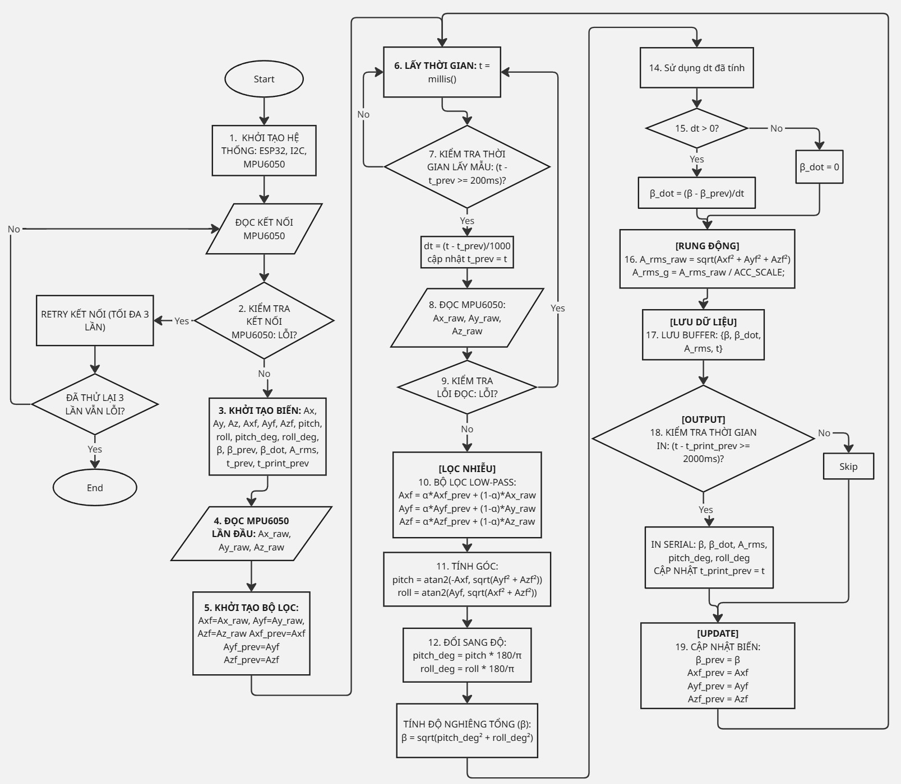

# Giải thích flowchart MPU6050

## Wiring

MPU6050 VCC  -> ESP32 3V3
MPU6050 GND  -> ESP32 GND
MPU6050 SCL  -> ESP32 GPIO22
MPU6050 SDA  -> ESP32 GPIO21



## Quy trình thuật toán đo độ nghiêng bằng MPU6050

Chương trình đo độ nghiêng MPU6050 được chia thành 2 phần chính: file `MPU6050_Tilt.h` đóng vai trò như thư viện giao tiếp cảm biến, còn `main.cpp` là chương trình chính để khởi tạo, đọc dữ liệu, xử lý góc nghiêng và xuất kết quả.

File `MPU6050_Tilt.h` định nghĩa class `MPU6050_Tilt`, trong đó có các hàm chính như `begin()` để kiểm tra kết nối I2C, đánh thức MPU6050 và cấu hình gia tốc kế ở thang đo ±2g; hàm `readAccelRaw()` để đọc dữ liệu gia tốc thô theo 3 trục `Ax_raw`, `Ay_raw`, `Az_raw` từ các thanh ghi của MPU6050. Các hàm `writeRegister()` và `readRegister()` dùng để ghi/đọc thanh ghi bên trong cảm biến thông qua giao tiếp I2C.

Khi chương trình bắt đầu, ESP32 khởi tạo hệ thống, I2C và cảm biến MPU6050. Sau đó ESP32 kiểm tra xem MPU6050 có phản hồi ở địa chỉ `0x68` hay không. Nếu cảm biến không phản hồi, hệ thống thử kết nối lại tối đa 3 lần. Nếu vẫn lỗi, chương trình báo lỗi phần cứng và dừng. Nếu kết nối thành công, chương trình tiếp tục khởi tạo các biến đo như `Ax`, `Ay`, `Az`, `pitch`, `roll`, `β`, `β_prev`, `β_dot`, `A_rms`, `t_prev`, `t_print_prev`.

Sau khi khởi tạo, hệ thống đọc gia tốc lần đầu từ MPU6050 để lấy giá trị ban đầu. Các giá trị này được dùng để khởi tạo bộ lọc, tránh việc bộ lọc bắt đầu từ 0 gây sai lệch lớn ở chu kỳ đo đầu tiên.

Trong vòng lặp chính, ESP32 lấy thời gian hiện tại bằng `millis()`. Hệ thống chỉ thực hiện một chu kỳ đo mới khi đủ khoảng thời gian lấy mẫu, ví dụ `t - t_prev >= 200 ms`. Cách này giúp chu kỳ đo ổn định hơn thay vì dùng delay cứng liên tục.

Khi đến thời điểm đo, chương trình tính:

```text
dt = (t - t_prev) / 1000
```

Trong đó `dt` là khoảng thời gian giữa hai lần đo, tính bằng giây. Sau đó cập nhật `t_prev = t`.

Tiếp theo, ESP32 đọc dữ liệu gia tốc thô từ MPU6050 gồm:

```text
Ax_raw, Ay_raw, Az_raw
```

Nếu quá trình đọc lỗi, chương trình bỏ qua chu kỳ hiện tại và quay lại vòng lặp sau. Nếu đọc thành công, dữ liệu thô được đưa qua bộ lọc low-pass:

```text
Axf = α × Axf_prev + (1 - α) × Ax_raw
Ayf = α × Ayf_prev + (1 - α) × Ay_raw
Azf = α × Azf_prev + (1 - α) × Az_raw
```

Bộ lọc này giúp làm mượt tín hiệu gia tốc, giảm nhiễu và hạn chế giá trị nhảy đột ngột.

Sau khi lọc, chương trình tính góc nghiêng theo hai trục:

```text
pitch = atan2(-Axf, sqrt(Ayf² + Azf²))
roll  = atan2(Ayf, sqrt(Axf² + Azf²))
```

Hai góc này ban đầu ở đơn vị radian, sau đó được đổi sang độ:

```text
pitch_deg = pitch × 180 / π
roll_deg  = roll × 180 / π
```

Từ `pitch_deg` và `roll_deg`, hệ thống tính góc nghiêng tổng thể của mặt đất:

```text
β = sqrt(pitch_deg² + roll_deg²)
```

Giá trị `β` thể hiện mức nghiêng tổng hợp, không phụ thuộc riêng vào một trục.

Sau đó chương trình tính tốc độ thay đổi góc nghiêng:

```text
β_dot = (β - β_prev) / dt
```

Nếu `dt <= 0`, chương trình đặt:

```text
β_dot = 0
```

`β_dot` cho biết góc nghiêng đang thay đổi nhanh hay chậm. Nếu `β_dot` lớn, có thể đang có chuyển động, rung, lún hoặc trượt.

Tiếp theo, hệ thống tính chỉ số rung động:

```text
A_rms_raw = sqrt((Axf² + Ayf² + Azf²) / 3)
A_rms_g = A_rms_raw / ACC_SCALE
```

Trong đó `ACC_SCALE` là hệ số đổi dữ liệu raw sang đơn vị g. Với thang đo ±2g, giá trị thường dùng là `16384 LSB/g`. Chỉ số `A_rms_g` dùng để đánh giá mức rung/lắc của cảm biến.

Sau khi tính xong các đại lượng chính, chương trình lưu dữ liệu vào buffer gồm:

```text
β, β_dot, A_rms, t
```

Buffer này có thể dùng để lưu lịch sử, gửi IoT, vẽ biểu đồ hoặc phục vụ thuật toán cảnh báo.

Phần xuất dữ liệu không in liên tục ở mọi chu kỳ đo mà có kiểm tra thời gian riêng. Nếu đủ thời gian in, ví dụ:

```text
t - t_print_prev >= 2000 ms
```

thì chương trình in ra Serial các giá trị:

```text
pitch_deg
roll_deg
β
β_dot
A_rms
```

Sau khi in, cập nhật:

```text
t_print_prev = t
```

Cuối mỗi chu kỳ, chương trình cập nhật các biến dùng cho vòng lặp sau:

```text
β_prev = β
Axf_prev = Axf
Ayf_prev = Ayf
Azf_prev = Azf
```

Sau đó hệ thống quay lại lấy thời gian mới và tiếp tục vòng đo.

Tóm lại, thuật toán MPU6050 gồm các bước chính: **khởi tạo ESP32 và I2C → kiểm tra kết nối MPU6050 → đọc gia tốc thô → lọc low-pass → tính pitch/roll → đổi sang độ → tính góc nghiêng tổng β → tính tốc độ thay đổi β_dot → tính chỉ số rung A_rms → lưu buffer → xuất Serial theo chu kỳ → cập nhật biến → lặp lại**.

Hệ thống hoạt động theo chu kỳ: mỗi 200 ms thực hiện đọc và xử lý dữ liệu cảm biến, và mỗi 2 giây xuất kết quả ra ngoài, đảm bảo vừa ổn định tín hiệu vừa tối ưu hiệu suất xử lý.
