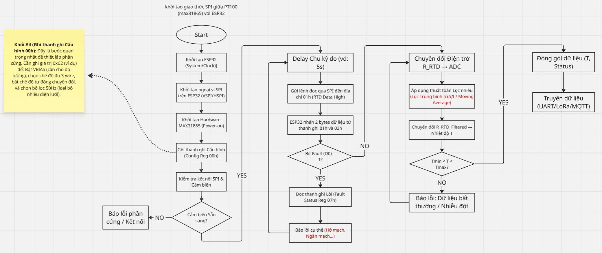

# Giải thích Flowchart PT100

## Wiring
2 dây cùng phe (2 dây xanh)
=> phải nằm bên phải:
RTD+ và F+

1 dây lẻ (đỏ)
=> phải nằm bên trái:
F- hoặc RTD-

| MAX31865 | ESP32  |
| -------- | ------ |
| VIN      | 3V3    |
| GND      | GND    |
| SCK      | GPIO18 |
| SDI      | GPIO23 |
| SDO      | GPIO19 |
| CS       | GPIO5  |

